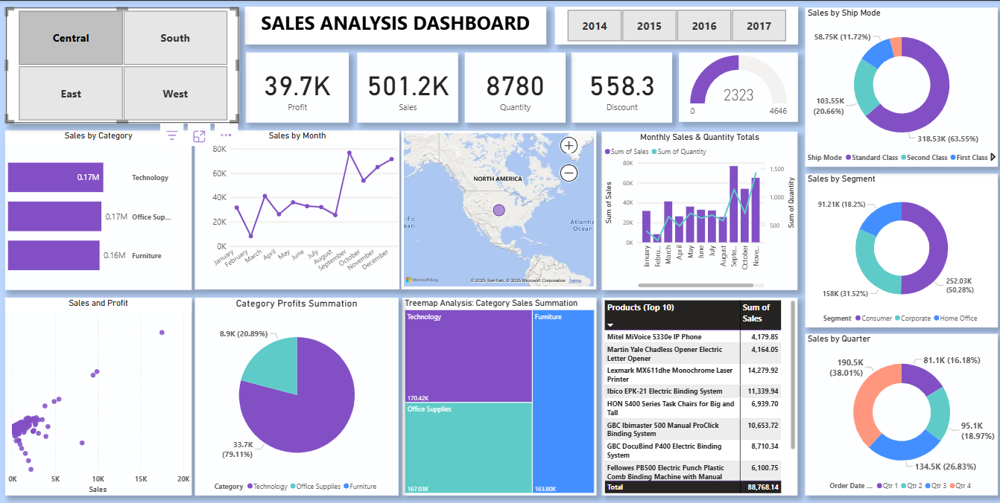

# 📊 Sales Analysis Power BI Dashboard

## 🧾 Overview

This Power BI project is a comprehensive **Sales Analysis Dashboard** built to visualize and monitor performance metrics from historical sales data across different business dimensions. The dashboard helps identify **trends, patterns, and performance bottlenecks** by offering insights across **regions, categories, customer segments, time periods, and shipping methods**.

---

## 🎯 Objectives

- Provide business users with an **interactive reporting tool** for decision-making.
- Track **KPIs** like Profit, Sales, Quantity, and Discounts.
- Understand **category-wise** and **region-wise** performance.
- Identify top-performing **products** and **sales trends** over time.
- Evaluate customer segments and shipping preferences.

---

## 📊 Key Features

### 📌 Interactive Filters:
- **Region Toggle**: Central, East, West, South
- **Year Slicer**: 2014–2017 (affects entire dashboard)

### 📈 Visualizations:
- **KPIs**: Profit, Sales, Quantity, Discount
- **Sales by Category & Segment**
- **Monthly and Quarterly Sales Trend**
- **Top 10 Products by Sales**
- **Sales vs. Profit Scatter Chart**
- **Ship Mode Analysis (Donut)**
- **Profit by Category (Pie)**
- **Category Sales Treemap**
- **Geographic Map** showing sales distribution

> 💡 **Note**: If map visuals are disabled, go to  
`File > Options and settings > Options > Global > Security > Enable map and filled map visuals`

---

## 🔍 Key Insights

- **Technology** and **Office Supplies** lead in both sales and profit.
- **Q4** consistently outperforms other quarters.
- **Standard Class** is the most popular shipping mode.
- **Consumer segment** drives over 50% of total sales.
- **Top 10 products** alone contribute over ₹88K in total sales.

---

## 🛠 Tech Stack

- **Power BI Desktop**
- Power Query Editor
- DAX for calculated measures
- Visual Elements: Slicers, Donuts, Treemaps, Scatter plots, Maps

---

## 📁 Files Included

| File | Description |
|------|-------------|
| `Sales Analysis Dashboard.pbix` | Main dashboard file |
| `dashboard.png` | Dashboard screenshot preview |

---

## 📸 Preview

---

## 👤 Author

**Shivam**  
📧 [shivam050205@gmail.com](mailto:shivam050205@gmail.com)  
🔗 [LinkedIn](https://www.linkedin.com/in/shivam-624172256/)  
🔗 [GitHub](https://github.com/Shivam-knight-owl)

---

